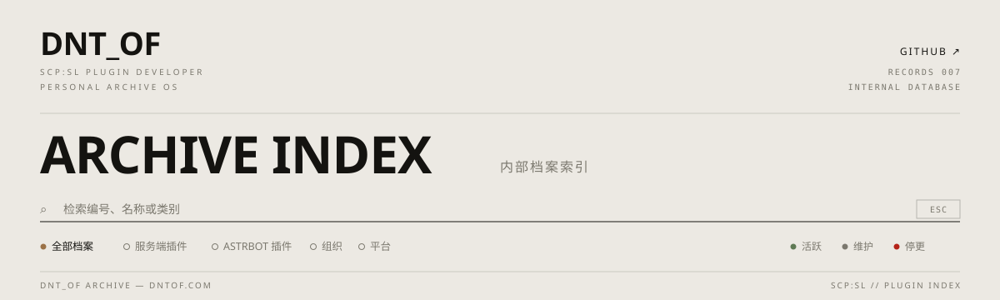

## FILE X-001 · OPERATOR

```text
OPERATOR  高中生，正在自学 C# 与 Python。
DOMAIN    SCP: Secret Laboratory 服务器生态——插件、数据接口与工具，
          把服务器实时数据做成可查询、可复用的东西。
STACK     C# · PYTHON · .NET · EXILED · ASTRBOT
STATUS    活跃开发
```

## ARCHIVE INDEX · 内部档案索引

| FILE / 编号 | ARCHIVE / 档案 | DEPARTMENT / 类别 | STATUS / 状态 |
| --- | --- | --- | --- |
| 001 | [SLDataAPI](https://github.com/DNTOF/SLDataAPI) | 服务端插件 · LabAPI · C#/.NET | ● 活跃 · v2.5.4 · GPLv3 |
| 002 | [astrbot_plugin_sl_query](https://github.com/DNTOF/astrbot_plugin_sl_query) | ASTRBOT 插件 · Python | ● 活跃 |
| 003 | [SLAgent](https://github.com/DNTOF/SLAgent) | 服务端插件 · EXILED · C# | ● 维护 |
| 004 | [astrbot_plugin_adsb_monitor](https://github.com/DNTOF/astrbot_plugin_adsb_monitor) | ASTRBOT 插件 · Python | ● 停更 |
| 005 | [DNT-118](https://github.com/DNT-118) | 开发组织 | ● 运作中 |
| 006 | [Foundation Console](https://dntof.com/platform/) | 平台 · SELF-HOSTED | ● 源码 2027-01-01 公开 |

> 001 运行于 SCP:SL 服务端，通过 HTTP / WebSocket API 实时暴露服务器状态——在线玩家、回合信息、核弹状态、阵营分布；002 是它的群聊查询前端，006 是它的自托管控制台（架构与版本记录见 [dntof.com/platform](https://dntof.com/platform/)）。

## SUPPORT · 支持开发

- 爱发电：https://afdian.com/a/DNT_OF
- 哔哩哔哩：https://space.bilibili.com/3493125592975851
