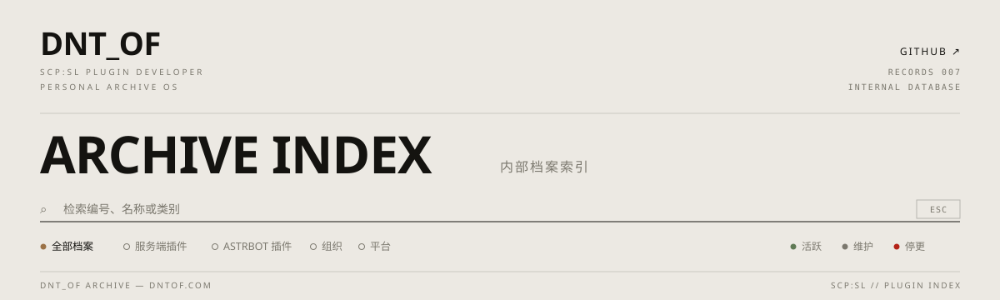

## FILE X-001 · OPERATOR

```text
OPERATOR  高中生，正在自学 C# 与 Python。
DOMAIN    SCP: Secret Laboratory 服务器生态——插件、数据接口与工具，
          把服务器实时数据做成可查询、可复用的东西。
STACK     C# · PYTHON · .NET · EXILED · ASTRBOT
STATUS    活跃开发
```

## ARCHIVE INDEX · 内部档案索引

| FILE / 编号 | ARCHIVE / 档案 | DEPARTMENT / 类别 | STATUS / 状态 |
| --- | --- | --- | --- |
| 001 | [SLDataAPI](https://github.com/DNTOF/SLDataAPI) | 服务端插件 · LabAPI · C#/.NET | ● 活跃 · v2.5.4 · GPLv3 |
| 002 | [astrbot_plugin_sl_query](https://github.com/DNTOF/astrbot_plugin_sl_query) | ASTRBOT 插件 · Python | ● 活跃 |
| 003 | [astrbot_plugin_adsb_monitor](https://github.com/DNTOF/astrbot_plugin_adsb_monitor) | ASTRBOT 插件 · Python | ● 停更 |

## SUPPORT · 支持开发

- 爱发电：https://afdian.com/a/DNT_OF
- 哔哩哔哩：https://space.bilibili.com/3493125592975851
